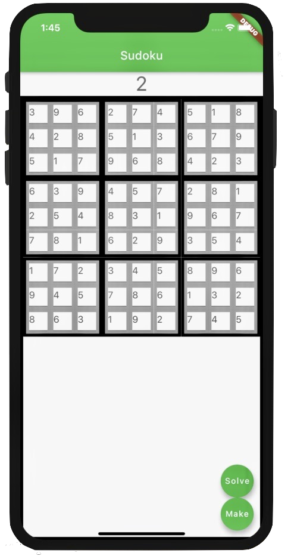

# Suduko

A new Flutter application for suduko.

# Motivation for building
My mom prefers Samurai Sudoku but has had trouble finding an app that supports it. I decided to make this to improve my understandings of optimizations and apps.

# Current Capabilities
Currently, the app can display a solved board or solve a partially filled board that it is given. It is very close to being able to convert the solved board it can generate into clues to make the given board.

# Future Work
I need to improve the user input as it is not as simple as I would like it to be yet. As hinted in the motivation section, I also plan to expand to Samarai Sudoku once I finish up the traditional Sudoku components. I would also like to be able to offer different difficulty levels.

# Screenshot

